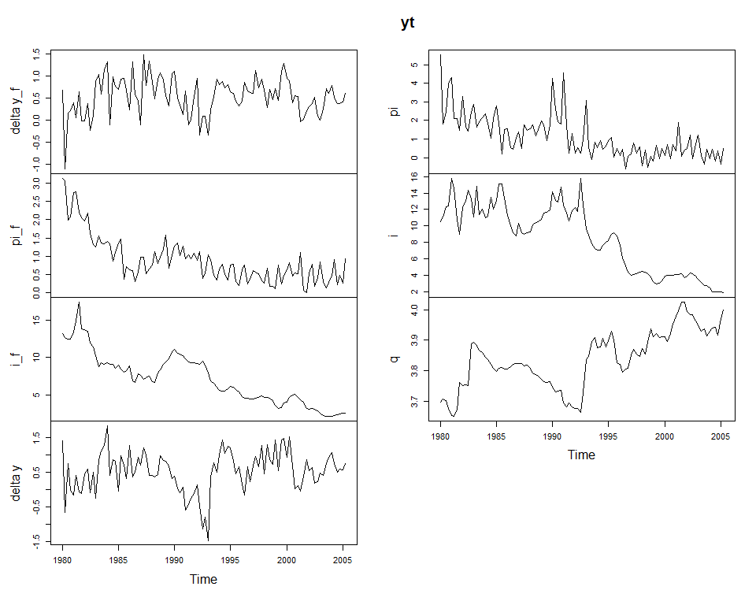
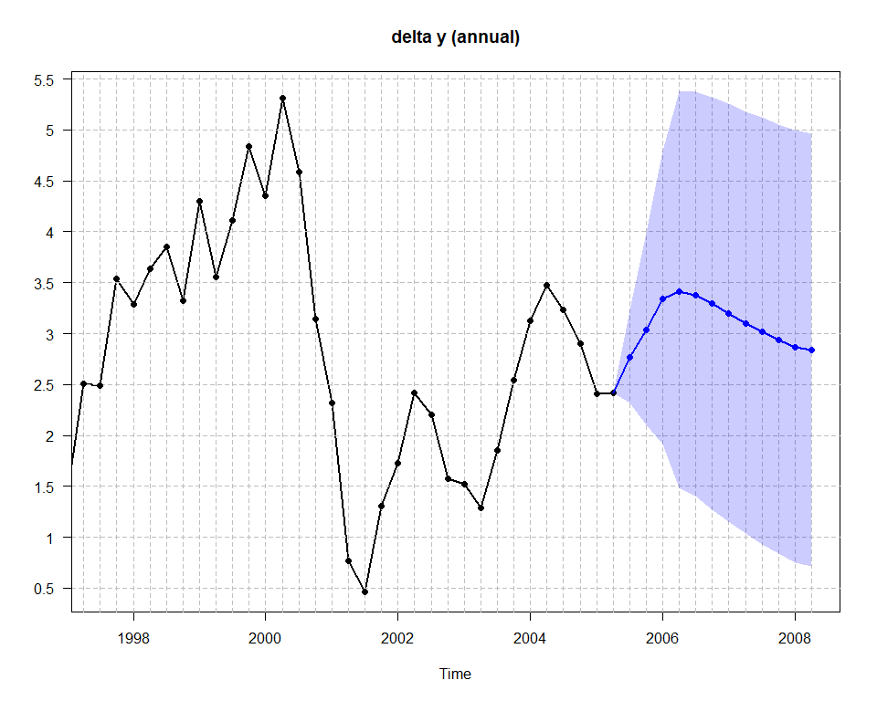
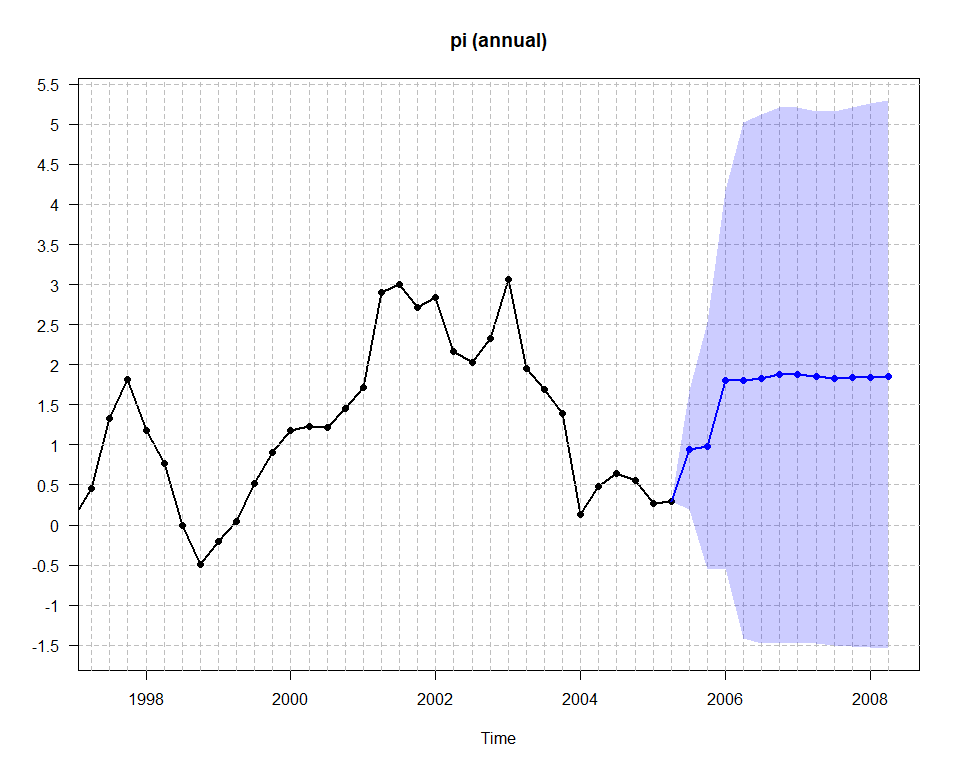
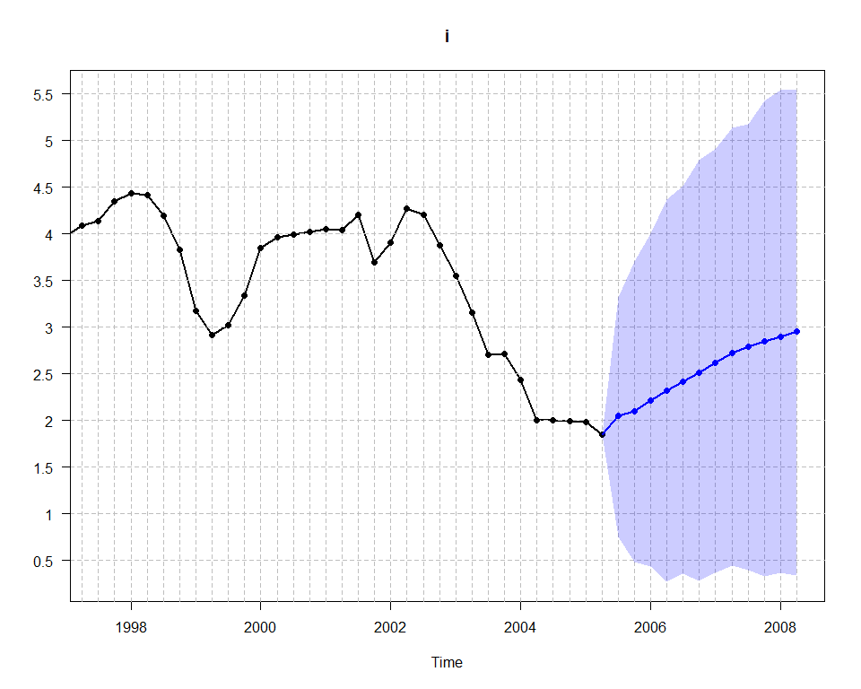

- [Karlsson2013inR](#karlsson2013inr)
  - [Installation](#installation)
  - [Introduction](#introduction)
  - [Algorithm 2 (normal-diffuse and independent
    normal-Wishart)](#algorithm-2-normal-diffuse-and-independent-normal-wishart)
  - [Algorithm 4 (steady-state)](#algorithm-4-steady-state)

<!-- README.md is generated from README.Rmd. Please edit that file -->

# Karlsson2013inR

<!-- badges: start -->
<!-- badges: end -->

This package implements the algorithms in Karlsson (2013) in R.

Karlsson, S. (2013). Forecasting with Bayesian Vector Autoregression.
In: Elliott, G. and Timmerman, A. (eds) *Handbook of Economic
Forecasting*. Elsevier B.V. Vol 2, Part B., pp. 791-897.

## Installation

``` r
remotes::install_github("markjwbecker/Karlsson2013inR", force = TRUE, upgrade = "never")
```

## Introduction

The BVAR model is

$$
\begin{aligned}
y_t'&=\sum_{i=1}^p y_{t-i}' A_i + x_t' C + u_t'\\
&=z_t'\Gamma + u_t'
\end{aligned}
$$

where $x_t$ is a vector of $d$ deterministic variables (constant and or
dummy/time trend), and

$$
z_t' = \begin{pmatrix}y_{t-1}',\dots,y_{t-p}',x_t'\end{pmatrix}
$$

is a $k=mp+d$ dimensional vector, and

$$
\Gamma=\begin{pmatrix}A_1',\dots,A_p',C'\end{pmatrix}'
$$

is a $k \times m$ matrix. We have normally distributed errors
$u_t \sim N(0, \Psi)$.

## Algorithm 2 (normal-diffuse and independent normal-Wishart)

The prior is

$$
\pi (\Gamma, \Psi) = \pi (\Gamma) \pi (\Psi)
$$

with $\pi (\Gamma)$ normal

$$
\gamma = \textrm{vec} (\Gamma) \sim N(\underline{\gamma}, \underline{\Sigma}_{\gamma})
$$

based on the Minnesota prior with overall tightness $\pi_1$,
cross-equation tightness $\pi_2$ and lag decay rate $\pi_3$. We also
have a hyperparameter $\pi_4$ for the deterministic terms. For the
normal-diffuse prior, we use Jeffreys’ prior for $\Psi$

$$
p(\Psi) \propto\left|\Psi \right|^{-(m+1)/2}
$$

for the independent normal-Wishart we use

$$
\Psi \sim iW(\underline{S}, \underline{v})
$$

An uninformative prior can be (and is in this package) specified by
setting $\underline{S}=(m_0-k-1)\hat{\Psi}$ where $\hat{\Psi}$ is the
least squares estimate from the VAR($p$) (including the constant and
dummy/trend variable if applicable), and $\underline{v}=m+2$.

``` r
rm(list = ls())
library(Karlsson2013inR)
data("Canada", package="vars")
yt <- Canada
plot.ts(yt)
```


``` r

bvar_obj1 <- bvar(data = yt)
bvar_obj1 <- setup(bvar_obj1,
                   p=4,
                   deterministic = "constant_and_trend")

bvar_obj2 <- bvar(data = yt)
bvar_obj2 <- setup(bvar_obj2,
                   p=4,
                   deterministic = "constant_and_trend")

####
# If 'Jeffrey=TRUE'  -> normal diffuse
# If 'Jeffrey=FALSE' -> independent normal-Wishart
####

bvar_obj1 <- priors(bvar_obj1,
                    pi_1=0.2,
                    pi_2=0.5,
                    pi_3=1.0,
                    pi_4=100,
                    first_own_lag_prior_mean=c(1,1,1,1), #fol_pm = first own lag prior means
                    Jeffrey=TRUE)

bvar_obj2 <- priors(bvar_obj2,
                    pi_1=0.2,
                    pi_2=0.5,
                    pi_3=1.0,
                    pi_4=100,
                    first_own_lag_prior_mean=c(1,1,1,1),
                    Jeffrey=FALSE)

p <- bvar_obj1$setup$p
m <- bvar_obj1$setup$m
d <- bvar_obj1$setup$d
restriction_matrix <- matrix(1, (m*p)+d, m)

restriction_matrix[m*p+2, 4] <- 0 #no trend term for unemployment

bvar_obj1 <- restrict_Gamma(bvar_obj1, restriction_matrix)
bvar_obj2 <- restrict_Gamma(bvar_obj2, restriction_matrix)


bvar_obj1$predict$H <- 20
bvar_obj1$predict$x_pred <- cbind(rep(1, 20), (nrow(yt)+1):(nrow(yt)+20))
bvar_obj2$predict$H <- 20
bvar_obj2$predict$x_pred <- cbind(rep(1, 20), (nrow(yt)+1):(nrow(yt)+20))

bvar_obj1 <- fit(bvar_obj1,
                iter = 10000,
                warmup = 2500)

bvar_obj2 <- fit(bvar_obj2,
                iter = 10000,
                warmup = 2500)

round(bvar_obj1$fit$Algorithm2$Gamma_posterior_mean,2)
#>        [,1]  [,2]  [,3]  [,4]
#>  [1,]  1.16  0.08  0.00 -0.10
#>  [2,]  0.09  1.03 -0.13 -0.04
#>  [3,] -0.03 -0.05  0.87  0.00
#>  [4,] -0.04  0.09  0.02  0.98
#>  [5,] -0.19 -0.02  0.07  0.04
#>  [6,]  0.00 -0.07 -0.04  0.00
#>  [7,]  0.01 -0.02 -0.05  0.01
#>  [8,]  0.05  0.10 -0.07 -0.04
#>  [9,] -0.03  0.00  0.03  0.05
#> [10,]  0.00 -0.03  0.01  0.00
#> [11,]  0.01  0.00  0.03  0.00
#> [12,]  0.04  0.05 -0.02 -0.01
#> [13,]  0.01  0.00  0.01  0.03
#> [14,]  0.00 -0.02  0.00  0.00
#> [15,]  0.01  0.01  0.05  0.00
#> [16,]  0.02  0.02  0.00 -0.02
#> [17,] -0.10  1.99  0.20  3.01
#> [18,]  0.00  0.06  0.04  0.00
round(bvar_obj2$fit$Algorithm2$Gamma_posterior_mean,2)
#>        [,1]  [,2]  [,3]  [,4]
#>  [1,]  1.17  0.08  0.00 -0.10
#>  [2,]  0.09  1.03 -0.13 -0.04
#>  [3,] -0.03 -0.05  0.87  0.00
#>  [4,] -0.04  0.08  0.02  0.98
#>  [5,] -0.19 -0.02  0.08  0.04
#>  [6,]  0.00 -0.07 -0.04  0.00
#>  [7,]  0.01 -0.02 -0.05  0.01
#>  [8,]  0.05  0.11 -0.08 -0.04
#>  [9,] -0.03  0.00  0.03  0.05
#> [10,]  0.00 -0.03  0.01  0.00
#> [11,]  0.01  0.00  0.03  0.00
#> [12,]  0.04  0.05 -0.02 -0.01
#> [13,]  0.02  0.00  0.01  0.03
#> [14,]  0.00 -0.02  0.00  0.00
#> [15,]  0.01  0.01  0.06  0.00
#> [16,]  0.02  0.02  0.00 -0.01
#> [17,]  0.03  3.19  1.40  3.12
#> [18,]  0.01  0.06  0.04  0.00

round(bvar_obj1$fit$Algorithm2$Psi_posterior_mean,2)
#>       [,1]  [,2]  [,3]  [,4]
#> [1,]  0.19  0.01 -0.10 -0.12
#> [2,]  0.01  0.45  0.00 -0.01
#> [3,] -0.10  0.00  0.61  0.08
#> [4,] -0.12 -0.01  0.08  0.12
round(bvar_obj2$fit$Algorithm2$Psi_posterior_mean,2)
#>       [,1] [,2]  [,3]  [,4]
#> [1,]  0.17 0.00 -0.09 -0.11
#> [2,]  0.00 0.42  0.00  0.00
#> [3,] -0.09 0.00  0.57  0.07
#> [4,] -0.11 0.00  0.07  0.11

par(mfcol = c(4, 2))
fcst1 <- forecast(bvar_obj1,
                 ci = 0.95,
                 fcst_type = "median",
                 show_all = TRUE)

fcst2 <- forecast(bvar_obj2,
                 ci = 0.95,
                 fcst_type = "median",
                 show_all = TRUE)
```


``` r

m1 <- vars::VAR(yt, p=4, type="both") #constant and trend
plot(predict(m1, n.ahead=20))
```


## Algorithm 4 (steady-state)

Let $A(L)= I-A_1'L-\ldots-A_p'L^p$ we can then write the BVAR as

$$
A(L)y_t = C'x_t +u_t
$$

The unconditional expectation is the
$E(y_t)=\mu_t=A^{-1}(L)C'x_t=\Lambda x_t$. We can further rewrite the
model in mean deviation form

$$
A(L)(y_t-\Lambda x_t) = u_t
$$

We can further rewrite this as a non-linear regression

$$
y_t' =x_t'\Lambda' + \left[w_t'-q_t'(I_p \otimes \Lambda') \right]\Gamma_d +u_t'
$$

where

$$
w_t'=(y_{t-1}',\dots,y_{t-p}')
$$

is a $mp$-dimensional vector of lagged endogenous variables,

$$
q_t'=(x_{t-1}',\dots,x_{t-p}')
$$

is a $dp$-dimensional vector of lagged deterministic (exogenous)
variables, and

$$
\Gamma_d'=\begin{pmatrix} A_1',\dots,A_p'\end{pmatrix}
$$

The prior is

$$
\pi (\Gamma_d, \Lambda, \Psi) = \pi (\Gamma_d) \pi (\Lambda) \pi (\Psi)
$$

with $\pi (\Gamma_d)$ and $\pi (\Lambda)$ normal,

$$
\begin{aligned}
\gamma_d = \textrm{vec} (\Gamma_d) &\sim N(\underline{\gamma}_d, \underline{\Sigma}_d)\\
\lambda = \textrm{vec} (\Lambda) &\sim N(\underline{\lambda}, \underline{\Sigma}_{\lambda})
\end{aligned}
$$

Here $\pi (\Gamma_d)$ is based on the Minnesota prior with overall
tightness $\pi_1$, cross-equation tightness $\pi_2$ and lag decay rate
$\pi_3$. Note that $\pi (\Lambda)$ is the core of the steady-state
model, where we specify our prior beliefs about the location and scale
of the steady-state parameters. For $\Psi$ we use Jeffreys’ prior

$$
p(\Psi) \propto\left|\Psi \right|^{-(m+1)/2}
$$

Alternatively a proper inverse Wishart,
$\Psi \sim iW(\underline{S}, \underline{v})$, for $\Psi$ can be used. An
uninformative inverse Wishart prior can again be specified by setting
$\underline{S}=(m_0-k-1)\hat{\Psi}$ where $\hat{\Psi}$ is the least
squares estimate from the VAR($p$) (including the constant and
dummy/trend variable if applicable), and $\underline{v}=m+2$.

``` r
rm(list = ls())
par(mfcol = c(1, 1))

data("villani2009")
yt <- villani2009
yt <- ts(yt[1:102, ], start = start(yt), frequency = frequency(yt))
plot.ts(yt)
```



``` r

bvar_obj <- bvar(data = yt)

bp <- which(time(yt) == 1992.75)
dum_var <- c(rep(1,bp), rep(0,nrow(yt)-bp))

bvar_obj <- setup(bvar_obj,
                  p=4,
                  deterministic = "constant_and_dummy",
                  dummy = dum_var)
pi_1 <- 0.2
pi_2 <- 0.5
pi_3 <- 1.0

fol_pm=c(0,   #delta y_f
         0,   #pi_f
         0.9, #i_f
         0,   #delta y
         0,   #pi
         0.9, #i
         0.9  #q
         )

#lambda_1 = Lambda col 1
#lambda_2 = Lambda col 2
#lambda = vec(Lambda)

lambda_pr_mean <- 
  c(
  ppi( 2.00,  3.00,  annualized_growthrate=TRUE)$mean,   #lambda_1: delta y_f
  ppi( 1.50,  2.50,  annualized_growthrate=TRUE)$mean,   #lambda_1: pi_f
  ppi( 4.50,  5.50,  annualized_growthrate=FALSE)$mean,  #lambda_1: i_f
  ppi( 2.00,  2.50,  annualized_growthrate=TRUE)$mean,   #lambda_1: delta y
  ppi( 1.70,  2.30,  annualized_growthrate=TRUE)$mean,   #lambda_1: pi
  ppi( 4.00,  4.50,  annualized_growthrate=FALSE)$mean,  #lambda_1: i
  ppi( 3.85,  4.00,  annualized_growthrate=FALSE)$mean,  #lambda_1: q
  ppi(-1.00,  1.00,  annualized_growthrate=TRUE)$mean,   #lambda_2: delta y_f
  ppi( 1.50,  2.50,  annualized_growthrate=TRUE)$mean,   #lambda_2: pi_f
  ppi( 1.50,  2.50,  annualized_growthrate=FALSE)$mean,  #lambda_2: i_f
  ppi(-1.00,  1.00,  annualized_growthrate=TRUE)$mean,   #lambda_2: delta y
  ppi( 4.30,  5.70,  annualized_growthrate=TRUE)$mean,   #lambda_2: pi
  ppi( 3.00,  5.50,  annualized_growthrate=FALSE)$mean,  #lambda_2: i
  ppi(-0.50,  0.50,  annualized_growthrate=FALSE)$mean   #lambda_2: q
  )

lambda_pr_covmat <- 
  diag(
  c(
  ppi( 2.00,  3.00,  annualized_growthrate=TRUE)$var,    #lambda_1: delta y_f
  ppi( 1.50,  2.50,  annualized_growthrate=TRUE)$var,    #lambda_1: pi_f
  ppi( 4.50,  5.50,  annualized_growthrate=FALSE)$var,   #lambda_1: i_f
  ppi( 2.00,  2.50,  annualized_growthrate=TRUE)$var,    #lambda_1: delta y
  ppi( 1.70,  2.30,  annualized_growthrate=TRUE)$var,    #lambda_1: pi
  ppi( 4.00,  4.50,  annualized_growthrate=FALSE)$var,   #lambda_1: i
  ppi( 3.85,  4.00,  annualized_growthrate=FALSE)$var,   #lambda_1: q
  ppi(-1.00,  1.00,  annualized_growthrate=TRUE)$var,    #lambda_2: delta y_f
  ppi( 1.50,  2.50,  annualized_growthrate=TRUE)$var,    #lambda_2: pi_f
  ppi( 1.50,  2.50,  annualized_growthrate=FALSE)$var,   #lambda_2: i_f
  ppi(-1.00,  1.00,  annualized_growthrate=TRUE)$var,    #lambda_2: delta y
  ppi( 4.30,  5.70,  annualized_growthrate=TRUE)$var,    #lambda_2: pi
  ppi( 3.00,  5.50,  annualized_growthrate=FALSE)$var,   #lambda_2: i
  ppi(-0.50,  0.50,  annualized_growthrate=FALSE)$var    #lambda_2: q
  )
  )

bvar_obj <- priors(bvar_obj,
                   pi_1,
                   pi_2,
                   pi_3,
                   pi_4 = NULL,
                   first_own_lag_prior_mean=fol_pm,
                   steadystate=TRUE,
                   lambda_pr_mean=lambda_pr_mean,
                   lambda_pr_covmat=lambda_pr_covmat,
                   Jeffrey=TRUE) #Jeffreys' prior

p <- bvar_obj$setup$p
m <- bvar_obj$setup$m
mf <- 3 #first 3 variables are foreign in yt
restriction_matrix <- matrix(1, m*p, m)

for(i in 1:p){
  rows <- ((i-1)*m + mf + 1) : (i*m)
  cols <- 1:mf
  restriction_matrix[rows, cols] <- 0
}
bvar_obj <- restrict_Gamma_d(bvar_obj, restriction_matrix)

bvar_obj$predict$H <- 12
bvar_obj$predict$x_pred <- cbind(rep(1, 12), 0)

bvar_obj <- fit(bvar_obj,
                iter = 5000,
                warmup = 2500)

round(bvar_obj$fit$SteadyState$Gamma_d_posterior_mean,2)
#>        [,1]  [,2]  [,3]  [,4]  [,5]  [,6]  [,7]
#>  [1,]  0.18  0.03 -0.02  0.12  0.07 -0.12  0.00
#>  [2,] -0.02  0.32  0.26  0.12 -0.07  0.00  0.00
#>  [3,]  0.00  0.04  0.92 -0.04  0.06  0.05  0.00
#>  [4,]  0.00  0.00  0.00  0.23 -0.09 -0.11  0.00
#>  [5,]  0.00  0.00  0.00  0.00  0.07  0.06  0.00
#>  [6,]  0.00  0.00  0.00  0.00  0.02  0.76  0.00
#>  [7,]  0.00  0.00  0.00  1.24  3.96  0.72  0.93
#>  [8,]  0.03 -0.01  0.09  0.02 -0.02  0.09  0.00
#>  [9,]  0.01  0.02  0.04  0.00 -0.03 -0.15  0.00
#> [10,] -0.02 -0.01 -0.01  0.00  0.05  0.07  0.00
#> [11,]  0.00  0.00  0.00  0.12 -0.01  0.15  0.00
#> [12,]  0.00  0.00  0.00  0.01 -0.05 -0.05  0.00
#> [13,]  0.00  0.00  0.00 -0.01  0.01  0.04  0.00
#> [14,]  0.00  0.00  0.00  0.57 -0.36  0.30 -0.04
#> [15,]  0.01 -0.01  0.00  0.02 -0.02  0.00  0.00
#> [16,] -0.02  0.06 -0.01  0.00  0.08  0.02  0.00
#> [17,]  0.00  0.00  0.02  0.00  0.00  0.03  0.00
#> [18,]  0.00  0.00  0.00  0.06  0.01 -0.02  0.00
#> [19,]  0.00  0.00  0.00  0.00  0.02 -0.01  0.00
#> [20,]  0.00  0.00  0.00  0.01  0.00  0.00  0.00
#> [21,]  0.00  0.00  0.00 -0.15  0.00 -0.60  0.00
#> [22,]  0.03 -0.01  0.00 -0.01  0.03  0.02  0.00
#> [23,]  0.00  0.16 -0.03  0.01  0.01  0.01  0.00
#> [24,]  0.00  0.00 -0.02  0.00  0.00  0.03  0.00
#> [25,]  0.00  0.00  0.00 -0.08  0.01  0.03  0.00
#> [26,]  0.00  0.00  0.00  0.00  0.06 -0.02  0.00
#> [27,]  0.00  0.00  0.00  0.00 -0.01  0.00  0.00
#> [28,]  0.00  0.00  0.00 -0.15 -0.06 -0.13 -0.01
round(bvar_obj$fit$SteadyState$Lambda_posterior_mean,2)
#>      [,1]  [,2]
#> [1,] 0.58  0.08
#> [2,] 0.50  0.46
#> [3,] 4.94  2.02
#> [4,] 0.58 -0.04
#> [5,] 0.49  1.15
#> [6,] 4.29  4.48
#> [7,] 3.92 -0.10
round(bvar_obj$fit$SteadyState$Psi_posterior_mean,2)
#>       [,1]  [,2] [,3]  [,4]  [,5]  [,6]  [,7]
#> [1,]  0.15 -0.01 0.01  0.07 -0.01  0.01  0.00
#> [2,] -0.01  0.09 0.05  0.00  0.13  0.04  0.00
#> [3,]  0.01  0.05 0.52  0.01  0.18  0.11  0.00
#> [4,]  0.07  0.00 0.01  0.19 -0.05 -0.01  0.00
#> [5,] -0.01  0.13 0.18 -0.05  0.59  0.11  0.00
#> [6,]  0.01  0.04 0.11 -0.01  0.11  1.56 -0.01
#> [7,]  0.00  0.00 0.00  0.00  0.00 -0.01  0.00

fcst <- forecast(bvar_obj,
                 ci = 0.68,
                 fcst_type = "mean",
                 growth_rate_idx = c(4,5),
                 plot_idx = c(4,5,6))
```


